# AlmaLinux installation guide (ISO's)

These guide steps describe how to download AlmaLinux ISO, create a USB stick, and install AlmaLinux OS using it.

## System requirements

- Disk space: 10GB minimum, 20GB recommended
- Minimum 1.5 GB RAM

## AlmaLinux ISO

AlmaLinux supports both firmware interfaces: BIOS and UEFI.

AlmaLinux supports four architectures:

- Intel/AMD (x86_64)
- ARM64 (aarch64)
- IBM PowerPC (ppc64le)
- IBM Z (s390x)

AlmaLinux has 3 types of ISOs for each supported architecture:

| ISO     | Description                                                                       |
| ------- | --------------------------------------------------------------------------------- |
| boot    | a single network installation CD image that downloads packages over the Internet. |
| minimal | a minimal self-containing DVD image that makes offline installation possible.     |
| dvd     | a full installation DVD image that contains mostly all AlmaLinux packages.        |


> There are also latest and update ISO images. Latest provides the latest minor version of the selected major version, like AlmaLinux-9-latest. Update files are ISOs that were rebuilt including some updates.

Download AlmaLinux ISO from the mirror. Select the nearest to your geographic area mirror from the [list](https://mirrors.almalinux.org/isos.html). You need the `version/isos/arch/` directory to download the suitable ISO.

### Download from the Public Package Repository

[AlmaLinux 9](https://repo.almalinux.org/almalinux/9/isos/)
Lower and beta versions can be found in the [Vault](https://repo.almalinux.org/vault/)
Run the curl command in the command line:

```sh
curl -O https://repo.almalinux.org/almalinux/9/isos/x86_64/AlmaLinux-9.1-x86_64-dvd.iso
```

### ISO verification

Download and import the AlmaLinux public key:

```sh
curl -O https://repo.almalinux.org/almalinux/RPM-GPG-KEY-AlmaLinux-9
gpg --import RPM-GPG-KEY-AlmaLinux-9
```

Verify the downloaded ISO image checksum:

Download a checksums list

```sh
$ curl -O https://repo.almalinux.org/almalinux/9/isos/x86_64/CHECKSUM
```

Verify the checksums list, we are looking for a “Good signature”

```sh
gpg --verify CHECKSUM
```

Output:

```sh
gpg: Signature made Tue 13 Dec 2022 14:09:50 CET
gpg:                using RSA key BF18AC2876178908D6E71267D36CB86CB86B3716
gpg: Good signature from "AlmaLinux OS 9 <packager@almalinux.org>" [unknown]
gpg: WARNING: This key is not certified with a trusted signature!
gpg:          There is no indication that the signature belongs to the owner.
Primary key fingerprint: BF18 AC28 7617 8908 D6E7  1267 D36C B86C B86B 3716
```

Calculate the downloaded ISO SHA256 checksum

```sh
sha256sum AlmaLinux-9.1-x86_64-dvd.iso
```

Output:

```sh
2a44e3f8a012c132da19b9aae2bf949e20b116f0a2a7ac3eca111972f4ac952f  AlmaLinux-9.1-x86_64-dvd.iso
```

Compare it with the expected checksum, it should be the same

```sh
cat CHECKSUM | grep -E 'SHA256.*AlmaLinux-9.1-x86_64-dvd.iso'
```

Output:

```sh
SHA256 (AlmaLinux-9.1-x86_64-dvd.iso) = 2a44e3f8a012c132da19b9aae2bf949e20b116f0a2a7ac3eca111972f4ac952f
```

### Write an image on a USB stick
Use the following steps and commands depending on OS you are using to write an image on a USB.

#### Linux

Use the dd command for any Linux OS.

Insert your target USB and locate it. There are different ways to do it, but here are some of them:

- **sudo fdisk -l** - this command shows you the connected block storage devices, including the USB devices.
- **lsblk** - this command gives you all the available block storage devices, including the USB block storage devices.
- **sudo blkid** - this command gives you the same information as lsblk, but you have to run it as root.
You need to look for `/dev/sda` or `/dev/sdb` or `/dev/sdc`, which is your target USB.

After you found out the location of your target USB, navigate to the location of your source ISO. Run the dd command to copy files from ISO to USB:

```sh
sudo dd if=./AlmaLinux-9.1-x86_64-dvd.iso of=/dev/sdX status=progress
```

- **dd**: Start the dd command to write the DVD/CD iso image.
- **if=AlmaLinux-9.1-x86_64-dvd.iso**: path to the input file (This example is for AlmaLinux 9.1. Replace the version with the one you need to work with other AlmaLinux images.).
- **of=/dev/sdX**: path to destination USB disk/stick (you need to replace 'X').
- **status=progress**: display a progress bar while writing the image to the USB stick.

#### Windows

For Windows OS there is a helpful free and open-source application - [Rufus](https://rufus.ie/de/). Open the application, choose your target USB, and ISO you need to burn, and press `start`.

#### macOS

The cross-platform tool [balenaEtcher](https://etcher.balena.io)is used to write images on macOS. It is simple too. Open balenaEtcher, choose the image and the USB, and press Flash.

You can also use dd form CLI:

```sh
sudo dd if=./AlmaLinux-9.1-x86_64-dvd.iso of=/dev/diskXXX status=progress
```

Look at the Linux example above for detailed command elements description for the `dd` command.


## AlmaLinux installation

Before starting the installation, you might need to define which system's mode you are booting and installing - UEFI or BIOS. Insert and boot the USB stick. You'll see the AlmaLinux welcome menu:

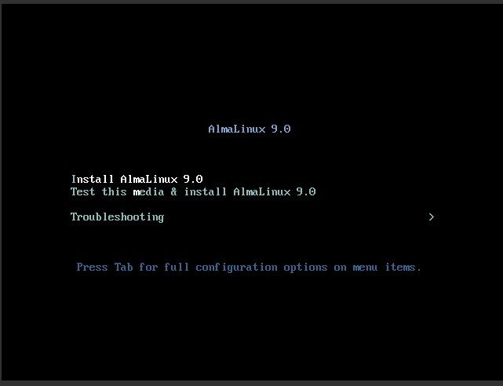

Automatically, the recommended option Test this media & install AlmaLinux is highlighted. Choosing this option will run the installation media check to verify that it's usable and that the installation won't be aborted in the process. After the media check completes successfully, the installer screen will pop up automatically.

When the installer boots, the first thing you need to do, is to choose a language that will be used during the installation process.

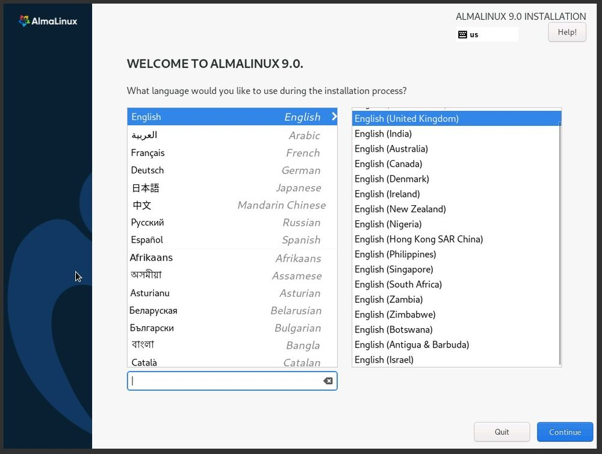

Choose the language you'd like and press the Continue button.

Next, the Installation Summary window will appear. It contains sections that you can configure:

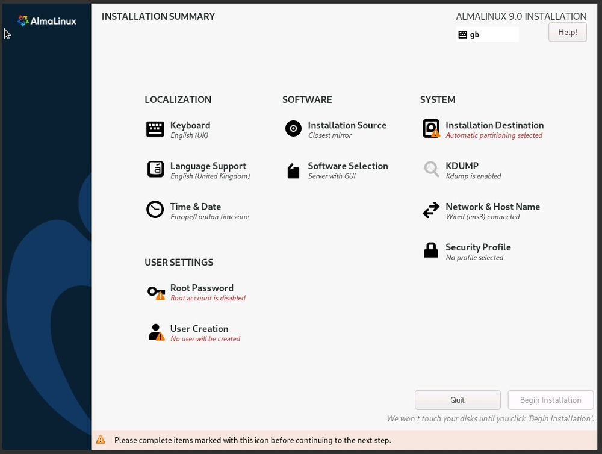

> Sections that are marked with red color are necessary to be customized to begin the installation.

In this guide, we will update the following items,

### Localization

#### Keyboard

Under **Localization** section, select **Keyboard**. You can add multiple layouts by pressing the (+) symbol. When you have multiple layouts, you can map a keystroke by pressing "options". Press "Done" to save the changes.

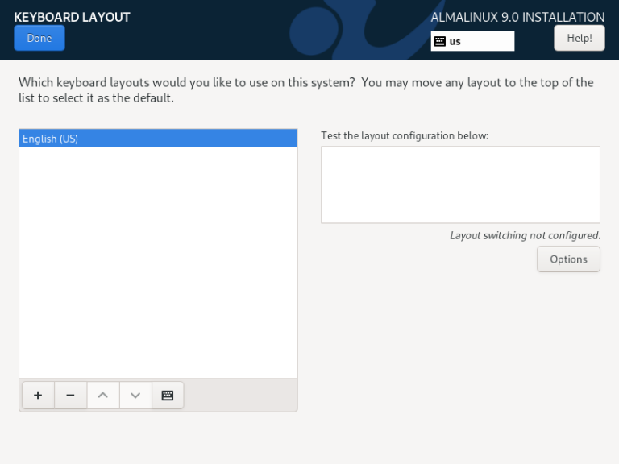

#### Language Support

Under **Localization**, select **Language Support**. Choose preferred languages and press "Done" to save the changes.


#### Time & Date

To change the date and time based on your geographical location, click on **Time & Date** item and then select your system’s geographical location. System clock will be adjusted based on the location. Press "Done" to save the changes.

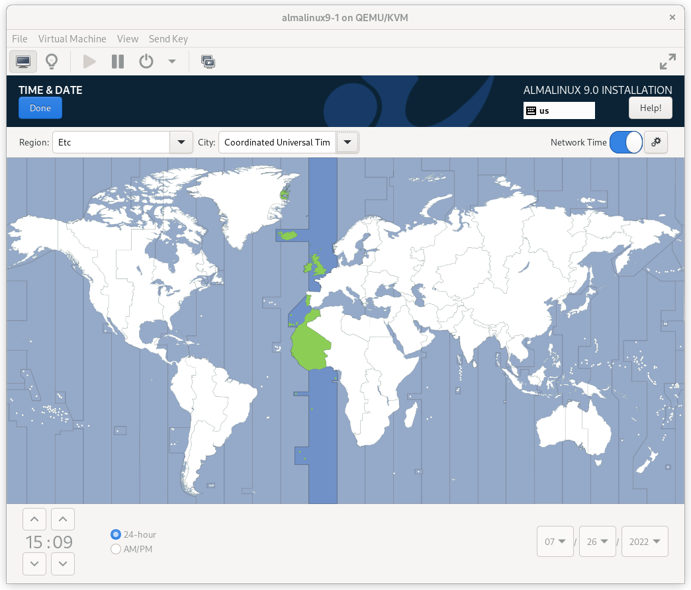

### USER Settings

#### Root Password

This is one of the mandatory steps in the installation process where you have to set up a password for the root user. The root user is the superuser for all Linux distributions. Make sure a very strong password is set for the root user.

Under **User Settings** section, select **Root Password** and enter the strong password. Press "Done" to save the changes.

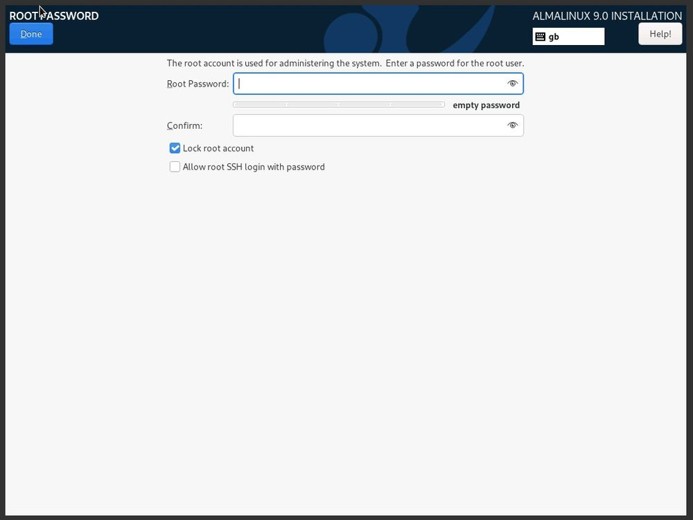

#### User Creation

This is a mandatory step where you will be creating a new user. Under **User Settings**, select **User Creation**. Fill in the details like username, password, and permission. Press "Done" to save the changes.

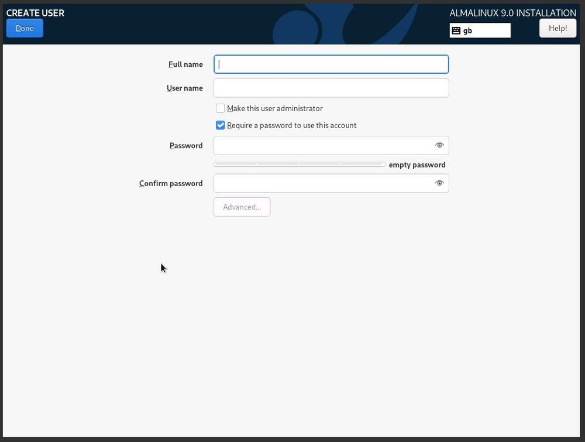

### Software

#### Installation Source

Under **Software** section, select **Installation Source**. You can either boot the iso or choose network install. In this case, I have booted the iso in the hypervisor (Virtualbox). The installer automatically detects the installation media. You can verify the iso image integrity by pressing "Verify".

By default "AppStream" repository is added. You can also add an additional repository by pressing the (+) symbol. Press "Done" to save the changes.

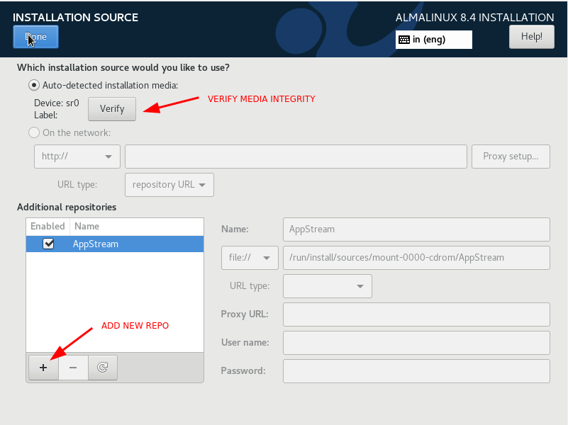

#### Software Selection

Go to the **Software Selection** settings and select the installation type. Multiple choices are provided and, by default, a GUI will be installed. If you prefer working over the CLI, you should go with **Minimal install** options. Additional software features can also be selected for each base environment. Press "Done" to save the changes.

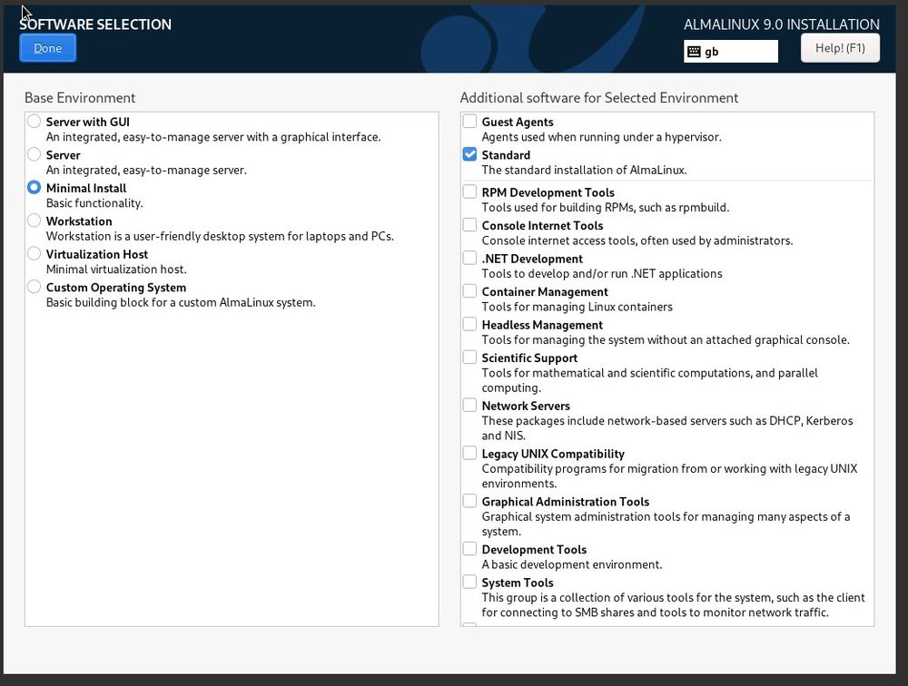

### System

#### Installation Destination

For those who prefer to go with an automatic configuration of their disk partition,
you can simply leave the **Automatic** button checked.

You can enable full-disk encryption by checking the **Encrypt my data** field.

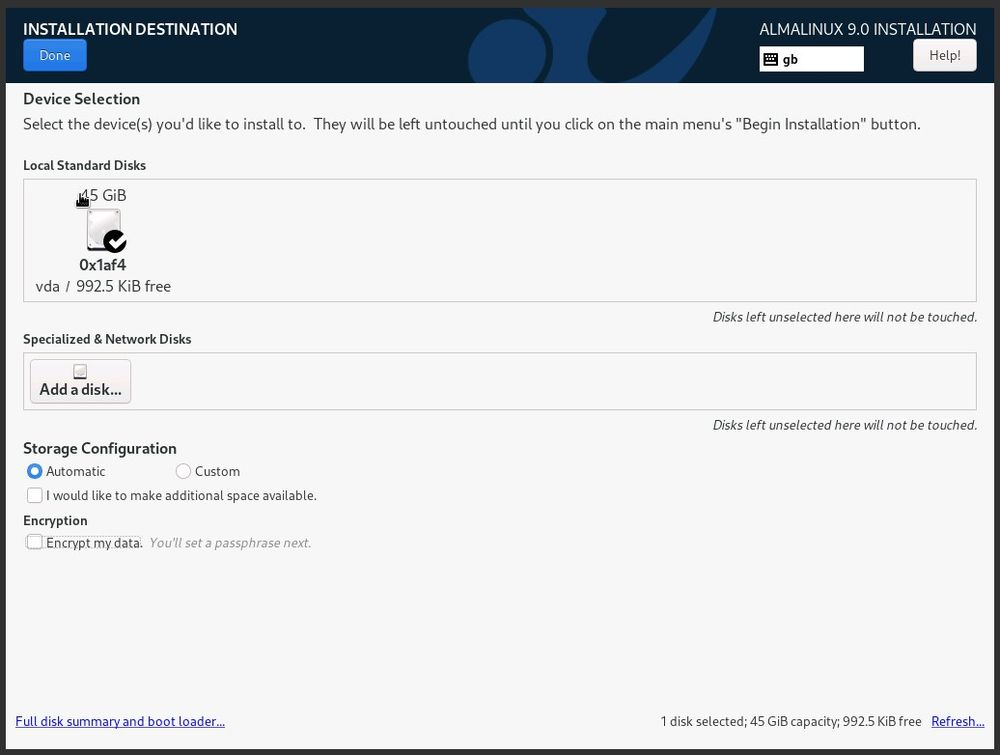

#### Network & Hostname

Under **System** section, select **Network & Hostname**. Your interface name will be visible and you can enable it by toggling the switch ON.

By default **localhost** is the default hostname. Under the new hostname section, you can enter a new hostname and press "Apply".

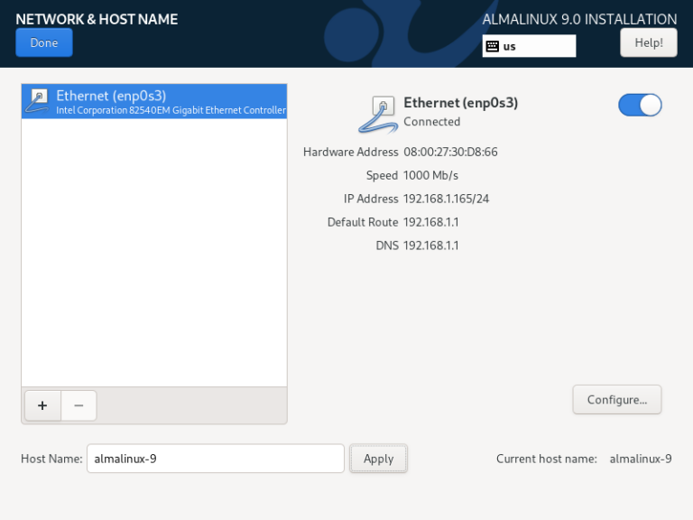

### Installation Progress

At this step, AlmaLinux installation got started and is in progress.

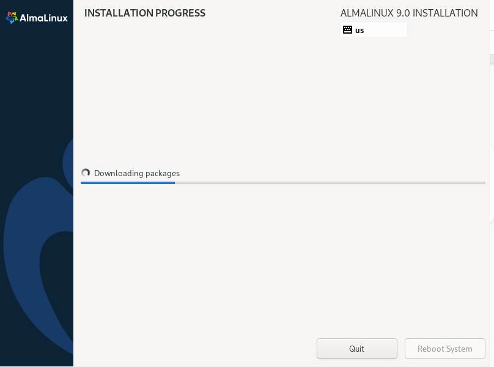

Once the installation is completed, installer will prompt us to reboot the system.

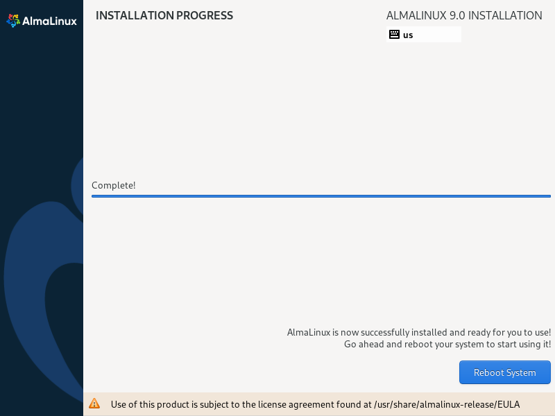
