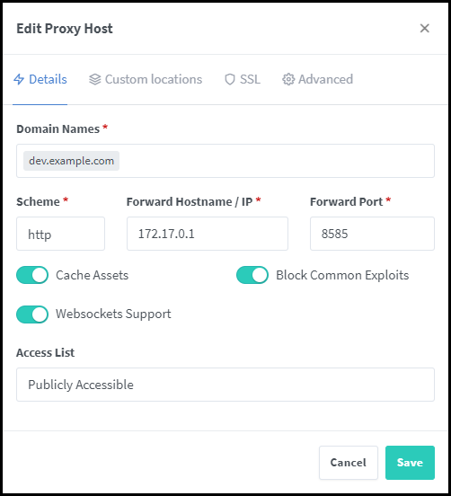
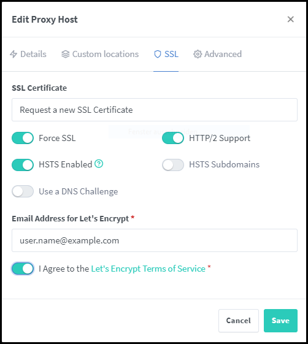

# Install Visual Studio Code

Run Visual Studio Code (VS Code for short) on any machine anywhere and access it in the browser.

## Highlights

- Code on any device with a consistent development environment
- Use cloud servers to speed up tests, compilations, downloads, and more
- Preserve battery life when you're on the go; all intensive tasks run on your server

## Visual Studio Code

Visual Studio Code is a free source code editor from Microsoft. Visual Studio Code is available cross-platform for the operating systems Windows, macOS and Linux. Visual Studio Code is based on the Electron framework and enables syntax highlighting, code folding, debugging, auto-completion and version management, among other features.

## Differences to Visual Studio

Except for the name, the logo and some features like IntelliSense, Visual Studio Code has nothing in common with Visual Studio. Unlike Visual Studio, Visual Studio Code does not work with project files, but on the basis of source code files and folders and also text files. For this reason VS Code works with so-called workspaces (working environments), which store a processing state, sequence of the opened files and their line position. These workspaces can also be recalled, for example when VS Code is started and a workspace file is opened.

## Language support

Visual Studio Code is primarily for programming with programming and markup languages such as Batch, C#, C++, Clojure, CoffeeScript, Coldfusion (Adobe/Lucee), CSS, Dart, Dockerfile, F#, Go, Groovy, Handlebars. js, HTML, Ini, Java, JavaScript, JSON, Julia, Less, Lua, Makefile, Markdown, Objective-C, Perl, PowerShell, PHP, Python, R, Ruby, Rust, Sass, SQL, Swift, TypeScript, Visual Basic, and XML. Plug-ins can be used to add support for any language.

## Requirements
See requirements for minimum specs, as well as instructions on how to set up a Google VM on which you can install code-server.

**TL;DR**: Linux machine with WebSockets enabled, 1 GB RAM, and 2 vCPU's

## Getting started

Using the [install script](https://github.com/coder/code-server/blob/main/install.sh) from https://github.com/coder/code-server , which automates most of the process. The script uses the system package manager if possible.

If you use the install script, you can preview what occurs during the install process:

```bash
curl -fsSL https://code-server.dev/install.sh | sh -s -- --dry-run
```

To install, run:

```bash
curl -fsSL https://code-server.dev/install.sh | sh
```

When done, the install script prints out instructions for running and starting code-server.

Add a sudo-user for the code-server

```bash
sudo adduser code-server
passwd code-server
sudo visudo
```

Add the line for `code-server`

```bash
## Allow root to run any commands anywhere
root            ALL=(ALL)       ALL
code-server     ALL=(ALL)       ALL
```

Login as code-server

```bash
su - code-server
```

After you have logged in as code-server run:

```bash
sudo systemctl enable --now code-server@$USER
```

Check if code-server is running:

```bash
sudo systemctl status code-server@$USER
```

Output:

```bash
[code-server@localhost code-server]$ sudo systemctl status --now code-server@$USER
● code-server@code-server.service - code-server
	  Loaded: loaded (/usr/lib/systemd/system/code-server@.service; enabled; preset: disabled)
	  Active: active (running) since Tue 2023-05-23 11:14:25 UTC; 5s ago
	Main PID: 760861 (node)
		Tasks: 22 (limit: 48779)
	  	Memory: 77.2M
		  CPU: 1.480s
	  	CGroup: /system.slice/system-code\x2dserver.slice/code-server@code-server.service
				 ├─760861 /usr/lib/code-server/lib/node /usr/lib/code-server
				 └─760881 /usr/lib/code-server/lib/node /usr/lib/code-server/out/node/entry

May 23 11:14:25 localhost systemd[1]: Starting code-server...
May 23 11:14:25 localhost systemd[1]: Started code-server.
May 23 11:14:26 localhost code-server[760861]: [2023-05-23T11:14:26.451Z] info  code-server 4.13.0 2798322b03e7f446f59c5142215c11711ed7a427
May 23 11:14:26 localhost code-server[760861]: [2023-05-23T11:14:26.452Z] info  Using user-data-dir ~/.local/share/code-server
May 23 11:14:26 localhost code-server[760861]: [2023-05-23T11:14:26.475Z] info  Using config file ~/.config/code-server/config.yaml
May 23 11:14:26 localhost code-server[760861]: [2023-05-23T11:14:26.475Z] info  HTTP server listening on http://127.0.0.1:8080/
May 23 11:14:26 localhost code-server[760861]: [2023-05-23T11:14:26.475Z] info	- Authentication is enabled
May 23 11:14:26 localhost code-server[760861]: [2023-05-23T11:14:26.476Z] info	- Using password from ~/.config/code-server/config.yaml
May 23 11:14:26 localhost code-server[760861]: [2023-05-23T11:14:26.476Z] info	- Not serving HTTPS
```

The next step is to change the directory to `/home/code-server/.config/code-server`. Open the `config.yaml` and change the bind-addr from `127.0.0.1:8585` to `0.0.0.0:8585`.

```bash
bind-addr: 0.0.0.0:8585
auth: password
password: 5729253452400d7e9590940725a
cert: false
```
After you have changed the bind-addr you have to restart the `code-server service`.

```bash
sudo systemctl stop --now code-server@$USER
sudo systemctl start --now code-server@$USER
sudo systemctl status --now code-server@$USER
```

Output:

```bash
[code-server@localhost code-server]$ sudo systemctl status --now code-server@$USER
● code-server@code-server.service - code-server
	  Loaded: loaded (/usr/lib/systemd/system/code-server@.service; enabled; preset: disabled)
	  Active: active (running) since Tue 2023-05-23 11:17:02 UTC; 4s ago
	Main PID: 761379 (node)
		Tasks: 22 (limit: 48779)
	  Memory: 74.8M
		  CPU: 1.541s
	  CGroup: /system.slice/system-code\x2dserver.slice/code-server@code-server.service
				 ├─761379 /usr/lib/code-server/lib/node /usr/lib/code-server
				 └─761399 /usr/lib/code-server/lib/node /usr/lib/code-server/out/node/entry

May 23 11:17:02 localhost systemd[1]: Starting code-server...
May 23 11:17:02 localhost systemd[1]: Started code-server.
May 23 11:17:03 localhost code-server[761379]: [2023-05-23T11:17:03.566Z] info  code-server 4.13.0 2798322b03e7f446f59c5142215c11711ed7a427
May 23 11:17:03 localhost code-server[761379]: [2023-05-23T11:17:03.568Z] info  Using user-data-dir ~/.local/share/code-server
May 23 11:17:03 localhost code-server[761379]: [2023-05-23T11:17:03.584Z] info  Using config file ~/.config/code-server/config.yaml
May 23 11:17:03 localhost code-server[761379]: [2023-05-23T11:17:03.584Z] info  HTTP server listening on http://0.0.0.0:8585/
May 23 11:17:03 localhost code-server[761379]: [2023-05-23T11:17:03.584Z] info  - Authentication is enabled
May 23 11:17:03 localhost code-server[761379]: [2023-05-23T11:17:03.585Z] info  - Using password from ~/.config/code-server/config.yaml
May 23 11:17:03 localhost code-server[761379]: [2023-05-23T11:17:03.585Z] info  - Not serving HTTPS
```

You can see that the HTTP server is listening on `http://0.0.0.0:8585/`

### settings.json

This is my personal settings.json.

```json
{
	"latex-workshop.intellisense.citation.backend": "biblatex",
	"latex-workshop.latex.autoBuild.run": "never",
	"latex-workshop.view.pdf.viewer": "tab",
	"latex-workshop.view.pdf.internal.synctex.keybinding": "double-click",
	"files.autoSave": "afterDelay",
	"files.autoSaveDelay": 30000,
	"latex-workshop.latex.recipes": [
		{
			"name": "lualatex -> biber -> makeglossaries -> lualatex 2x",
			"tools": [
				"lualatex",
				"biber",
				"makeglossaries",
				"lualatex",
				"lualatex",
				"lualatex"
			]
		},
		{
			"name": "lualatex",
			"tools": [
				"lualatex"
			]
		}
	],
	"latex-workshop.latex.tools": [
		{
			"name": "lualatex",
			"command": "lualatex",
			"args": [
				"-shell-escape",
				"-synctex=1",
				"-interaction=nonstopmode",
				"-file-line-error",
				"-pdf",
				"%DOC%"
			]
		},
		{
			"name": "biber",
			"command": "biber",
			"args": [
				"%DOCFILE%"
			]
		},
		{
			"name": "makeglossaries",
			"command": "makeglossaries",
			"args": [
				"%DOCFILE%"
			]
		}
	],
	"latex-workshop.latex.clean.method": "glob",
	"latex-workshop.latex.autoClean.run": "onBuilt",
	"latex-workshop.latex.clean.fileTypes": [
		"%DOCFILE%.aux",
		"%DOCFILE%.bbl",
		"%DOCFILE%.blg",
		"%DOCFILE%.idx",
		"%DOCFILE%.ilg",
		"%DOCFILE%.ind",
		"%DOCFILE%.lof",
		"%DOCFILE%.lot",
		"%DOCFILE%.out",
		"%DOCFILE%.toc",
		"%DOCFILE%.acn",
		"%DOCFILE%.acr",
		"%DOCFILE%.alg",
		"%DOCFILE%.glg",
		"%DOCFILE%.glo",
		"%DOCFILE%.gls",
		"%DOCFILE%.fls",
		"%DOCFILE%.log",
		"%DOCFILE%.fdb_latexmk",
		"%DOCFILE%.snm",
		"%DOCFILE%.synctex(busy)",
		"%DOCFILE%.synctex.gz(busy)",
		"%DOCFILE%.nav",
		"%DOCFILE%.vrb",
		"%DOCFILE%.abb",
		"%DOCFILE%.abrn",
		"%DOCFILE%.bcf",
		"%DOCFILE%.dvi",
		"%DOCFILE%.ist",
		"%DOCFILE%.nom",
		"%DOCFILE%.ntn",
		"%DOCFILE%.run.xml",
		"%DOCFILE%.synctex.gz"
	],
	"files.trimTrailingWhitespace": true,
	"editor.minimap.enabled": false,
	"editor.tabSize": 4,
	"editor.detectIndentation": true,
	"editor.formatOnSave": true,
	"workbench.startupEditor": "none",
	"cSpell.language": "en,de,de-DE,en-US",
}
```

### Update the Code-Server

To update code-server, install the new version over the old version. All user data is in `~/.local/share/code-server`, so they are preserved between installations.

### Remove the Code-Server

The code-server can be completely uninstalled by removing the application directory, and your user configuration directory.

To delete settings and data:

```bash
rm -rf ~/.local/share/code-server ~/.config/code-server
```

If you installed with the install script, by default code-server will be in `~/.local/lib/code-server-<version>` and you can remove it with rm -rf. e.g.

```bash
rm -rf ~/.local/lib/code-server-*
```

Now you can open the browser and type the IP Address and the port 8080 for your server. You can log in with the password from config.yaml. Don't forget to open the port for the firewall and to set an A-record for the subdomain in the DNS.

### Add the VS-Code Server into the NGINX Proxy Manager

Configure the details:



### Set the Let's Encrypt certificate

Change to SSL


