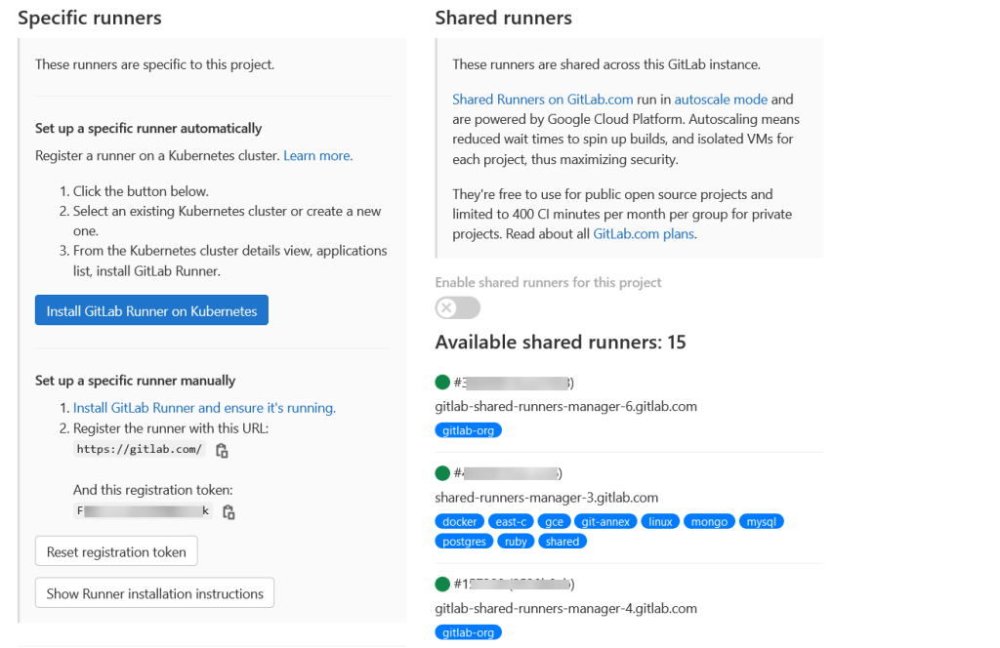

# Install GitLab Runner

GitLab Runner is the most used open source project which is used to run CI/CD  jobs and send the results back to GitLab Server. It is used to do CI/CD of jobs and supports Linux, Windows , Mac and other operating systems.

## Installing from GitLab Official Repository Manager

From the official GitLab Repo, it is very easy to install and configure the GitLab Runner. Run the GitLab Shell Script using CURL to add the Repository.

Debian, Mint, Ubuntu:

```sh
curl -L "https://packages.gitlab.com/install/repositories/runner/gitlab-runner/script.deb.sh" | bash
```

AlmaLinux, Rocky-Linux, CentOS, Red Hat Enterprise Linux:

```sh
curl -L "https://packages.gitlab.com/install/repositories/runner/gitlab-runner/script.rpm.sh" | bash
dnf install gitlab-runner
```

### Install from the repository manager

Debian, Mint, Ubuntu:

```sh
apt-get install gitlab-runner
```

AlmaLinux, Rocky-Linux, CentOS, Red Hat Enterprise Linux:

```sh
dnf install gitlab-runner
```

### Update GitLab Runner via package manager

Debian, Mint, Ubuntu:

```sh
apt-get install gitlab-runner
```

AlmaLinux, Rocky-Linux, CentOS, Red Hat Enterprise Linux:

```sh
dnf install gitlab-runner
```

## Install GitLab Runner by hand

The GitLab Team provide packages for the following supported versions of Linux distributions with [packagecloud](https://packages.gitlab.com/runner/gitlab-runner). Depending on your setup, other deb or rpm based distributions may also be supported. You may also be able to [install GitLab Runner as a binary](https://docs.gitlab.com/runner/install/linux-manually.html#using-binary-file) on other Linux distributions.

### Download the package for your system

1. Find the latest file name and options at https://gitlab-runner-downloads.s3.amazonaws.com/latest/index.html.
2. Choose a version and download a binary, as described in the documentation for downloading any other tagged releases for bleeding edge GitLab Runner releases.

Debian, Mint, Ubuntu:

Replace `${arch}` with any of the supported architectures, e.g. `amd64`, `arm`, `arm64`. A full list of architectures can be found here https://gitlab-runner-downloads.s3.amazonaws.com/latest/index.html

```sh
curl -LJO "https://gitlab-runner-downloads.s3.amazonaws.com/latest/deb/gitlab-runner_${arch}.deb"
 ```

AlmaLinux, Rocky-Linux, CentOS, Red Hat Enterprise Linux:

```sh
curl -LJO "https://gitlab-runner-downloads.s3.amazonaws.com/latest/rpm/gitlab-runner_${arch}.rpm"
```

FIPS compliant GitLab Runner on RHEL:

Currently only amd64 is a supported arch.

```sh
curl -LJO "https://gitlab-runner-downloads.s3.amazonaws.com/latest/rpm/gitlab-runner_amd64-fips.rpm"
```

### Install the package for your system

Debian, Mint, Ubuntu:

```sh
dpkg -i gitlab-runner_<arch>.deb
```

AlmaLinux, Rocky-Linux, CentOS, Red Hat Enterprise Linux:

```sh
rpm -i gitlab-runner_<arch>.rpm
```

### Update the latest package for your system

Download the latest package for your system then upgrade as follows:

Debian, Mint, Ubuntu:

```sh
dpkg -i gitlab-runner_<arch>.deb
```

AlmaLinux, Rocky-Linux, CentOS, Red Hat Enterprise Linux:

```sh
rpm -Uvh gitlab-runner_<arch>.rpm
```

## Install the GitLab from Binaries

Simply download one of the binaries for your system.

Linux x86-64

```sh
curl -L --output /usr/local/bin/gitlab-runner "https://gitlab-runner-downloads.s3.amazonaws.com/latest/binaries/gitlab-runner-linux-amd64"
```
Linux x86

```sh
curl -L --output /usr/local/bin/gitlab-runner "https://gitlab-runner-downloads.s3.amazonaws.com/latest/binaries/gitlab-runner-linux-386"
```

Linux arm

```sh
curl -L --output /usr/local/bin/gitlab-runner "https://gitlab-runner-downloads.s3.amazonaws.com/latest/binaries/gitlab-runner-linux-arm"
```

Linux arm64

```sh
curl -L --output /usr/local/bin/gitlab-runner "https://gitlab-runner-downloads.s3.amazonaws.com/latest/binaries/gitlab-runner-linux-arm64"
```

Linux s390x

```sh
curl -L --output /usr/local/bin/gitlab-runner "https://gitlab-runner-downloads.s3.amazonaws.com/latest/binaries/gitlab-runner-linux-s390x"
```

Linux ppc64le

```sh
curl -L --output /usr/local/bin/gitlab-runner "https://gitlab-runner-downloads.s3.amazonaws.com/latest/binaries/gitlab-runner-linux-ppc64le"
```

Linux x86-64 FIPS Compliant

```sh
curl -L --output /usr/local/bin/gitlab-runner "https://gitlab-runner-downloads.s3.amazonaws.com/latest/binaries/gitlab-runner-linux-amd64-fips"
```
You can download a binary for every available version as described in [Bleeding Edge - download any other tagged release](https://docs.gitlab.com/runner/install/bleeding-edge.html#download-any-other-tagged-release).

Give it permissions to execute:

```sh
chmod +x /usr/local/bin/gitlab-runner
```

Create a GitLab CI user:

```sh
useradd --comment 'GitLab Runner' --create-home gitlab-runner --shell /bin/bash
```

Install and run as service:

```sh
gitlab-runner install --user=gitlab-runner --working-directory=/home/gitlab-runner
gitlab-runner start
```

Ensure you have `/usr/local/bin/` in `$PATH` for root or you might get a `command not found` error. Alternately, you can install `gitlab-runner` in a different location, like `/usr/bin/`.

> If `gitlab-runner` is installed and run as service (what is described in this page), it will run as root, but will execute jobs as user specified by the `install` command. This means that some of the job functions like cache and artifacts will need to execute `/usr/local/bin/gitlab-runner` command, therefore the user under which jobs are run, needs to have access to the executable.

### Update Binaries

Stop the service (you need elevated command prompt as before):

```sh
gitlab-runner stop
```

Download the binary to replace the GitLab Runner executable. For example:

```sh
curl -L --output /usr/local/bin/gitlab-runner "https://gitlab-runner-downloads.s3.amazonaws.com/latest/binaries/gitlab-runner-linux-amd64"
```

You can download a binary for every available version as described in [Bleeding Edge - download](https://docs.gitlab.com/runner/install/bleeding-edge.html#download-any-other-tagged-release) any other tagged release.

Give it permissions to execute:

```sh
chmod +x /usr/local/bin/gitlab-runner
```

Start the service:

```sh
sudo gitlab-runner start
```

## Install GitLab Runner on Docker Container

Running the GitLab Runner is easy and yet suggested best way. To do so, Run the following command

```sh
$ docker run -d --name gitlab-runner --restart always \
	 -v /srv/gitlab-runner/config:/etc/gitlab-runner \
	 -v /var/run/docker.sock:/var/run/docker.sock \
	 gitlab/gitlab-runner:latest
```

## Register GitLab Runner

To get GitLab Runner Configured on the GitLab Instance, you need to get the configuration details that can be added to the runner for authentication. To do so,

1. Go to GitLab instance and select any of the projects you want to configure.
2. Then in the Settings, Click CICD Then in the list of CICD Settings Expand Runner.
3. There you can see, Specific Runner and Shared Runner in the list.
4. Shared Runners are provided by GitLab.com which is cloud-based autoscale-able Runners.
5. But we need a Specific Runner, In which Look for the `Set Up a Runner Manually``



Then just copy the URL and Registration token and keep it with you for the next process.

### Configure GitLab Runner

You just need to run register command from the binary or the executor you just installed on your operating system.

Running the GitLab Runner on linux

```sh
gitlab-runner register
```

Running in a Docker Container

```sh
docker run --rm -it -v /srv/gitlab-runner/config:/etc/gitlab-runner gitlab/gitlab-runner register
```

This will prompt you some questions and just give the answers to register yourself, or, to register as one line, use the following command or parameters.

```sh
gitlab-runner register \
--non-interactive \
--url "https://gitlab.com/" \
--registration-token "<Give you token from GitLab>" \
--executor "docker" \
--docker-image alpine:latest \
--description "docker-runner" \
--tag-list "docker, CICD" \
--run-untagged="true" \
--locked="false" \
--access-level="not_protected"
```

In the above Just use the `Copied URL` and `Registration Token` we saw in the Setting page of GitLab Instance.
