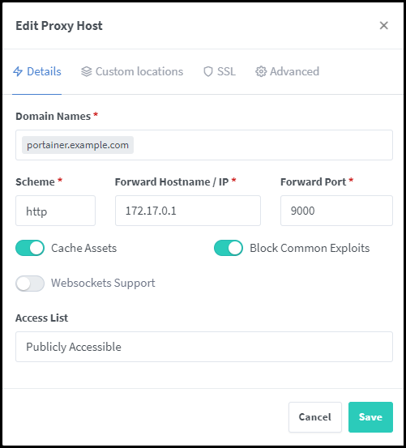

# Install Portainer CE with Docker

Portainer is an open source tool for managing container-based applications under Docker, Kubernetes, Docker Swarm and Azure ACI. In doing so, Portainer provides a convenient user interface for managing the Docker environment.

The prerequisite for installing Portainer is a working Docker environment or a set up Docker host. The first step is to provision a volume for Portainer under Docker, which is mounted and used by Portainer inside the Portainer container to `/data`.

```bash
docker volume create portainer_data
```

Then the Portainer container is created with the following command:

```bash
docker run -d -p 8000:8000 -p 9000:9000 --name=portainer --restart=always -v /var/run/docker.sock:/var/run/docker.sock -v portainer_data:/data portainer/portainer-ce
```

The portainer image is automatically downloaded and the container is created. That's it - it couldn't be easier!

The user interface of Portainer can now be reached via the following url:

```bash
http://IP_ADRESSE:9000/
```

When the GUI is called for the first time, a password must be assigned.

Here is a short overview of the parameters:

| Parameter | Erklärung                                                                                    |
| --------- | -------------------------------------------------------------------------------------------- |
| Port 8000 | Port used for the SSH tunnel between the client and the Portainer instance.                  |
| Port 9000 | Port to access the GUI and the API                                                           |
| –-name    | Container name                                                                               |
| –-restart | The container is always (always) started when the Docker host is restarted.                  |
| --volume  | Mounting two volumes (Docker host's socket and the previously created volume for Portainer). |

## Update Portainer
Of course, there are also updates and new versions of Portainer that should be installed. But how do you do that? A running Portainer container cannot be updated from within Portainer (chicken-and-egg problem).

Updating the Portainer container is done from the command line.

First we display all running containers:

Show and delete container Id

```bash
docker container ls
```

Then the running Portainer container is stopped:

```bash
docker stop portainer
```

Then the stopped container is deleted via the Id:

```bash
docker container rm ID
```

It is generally sufficient to specify IDs with the first characters, as long as they are unique.

The same is now done for the images. We also display them and delete the portainer image via the corresponding ID.

```bash
docker image ls
docker image rm ID
```

Portainer is then reinstalled as described at the beginning. This uses the persistent volume that was created during the initial installation, so that all settings that were made previously are available to us again after an update:

```bash
docker run -d -p 8000:8000 -p 9000:9000 --name=portainer --restart=always -v /var/run/docker.sock:/var/run/docker.sock -v portainer_data:/data portainer/portainer-ce
```

Log back into the user interface using the familiar credentials.

### Add Portainer into the NGINX Proxy Manager

Configure the details:



### Set the Let's Encrypt certificate

Change to SSL

