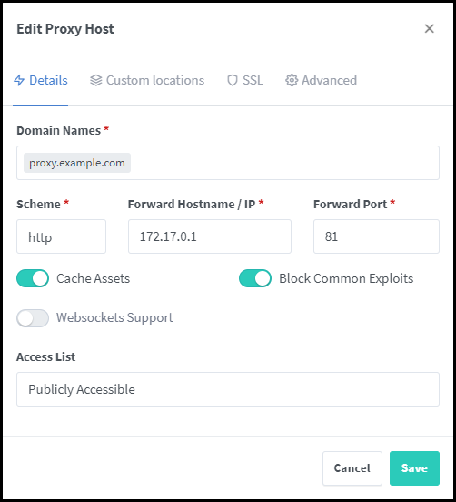
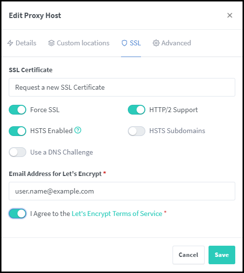

# Install NGINX Reverse Proxy Manager with Portainer

NGINX proxy manager is a reverse proxy management system, that is based on NGINX with a nice and clean web UI. You can also obtain trusted SSL certificates, manage several proxies with individual configs, customizations, and intrusion protection. It is open-source and maintained GitHub. It’s perfect for small environments like home labs or small server environments. You can easily expose any web service or application with it. It includes a free SSL certificate management by letsencrypt that can also be used to obtain wildcard certs. To deploy the NGINX proxy manager you need a small MySQL database container and the NGINX container. Let’s have a look at how to deploy this easily with docker-compose.

## Create a DNS A record for your (sub) domain that points to your server

Create a new `A record` on the server that is called `proxy.example.com` that points to the `public IP` of the virtual server.

## Deploy the NGINX Proxy Manager in Portainer

If Portainer is used for the NGINX Proxy Manager, only the `docker-compose.yaml` is required. The `.env` file is not required.

```sh
version: '3.8'
services:
	app:
		image: 'jc21/nginx-proxy-manager:latest'
		ports:
			- '80:80'
			- '81:81'
			- '443:443'
		restart: always
		links:
			- 'db:db'
		environment:
			DB_MYSQL_HOST: "db"
			DB_MYSQL_PORT: 3306
			DB_MYSQL_USER: ${USERNAME}
			DB_MYSQL_PASSWORD: ${PASSWORD}
			DB_MYSQL_NAME: ${MYSQLNAME}
		volumes:
			- ./data:/data
			- ./letsencrypt:/etc/letsencrypt
	db:
		image: 'jc21/mariadb-aria:latest'
		restart: always
		environment:
			MYSQL_ROOT_PASSWORD: ${ROOTPASSWD}
			MYSQL_DATABASE: ${DATABASE}
			MYSQL_USER: ${USERNAME}
			MYSQL_PASSWORD: ${PASSWORD}
		volumes:
			- ./data/mysql:/var/lib/mysql
```


## Deploy the NGINX Proxy Manager in Docker

Create a `docker-compose.yaml` file and a new project folder in the `/opt` directory called nginxproxymanager.

### The Password file

Store passwords in plain text is not a good idea. Create `.env` file with the following content:

```sh
USERNAME=proxy
PASSWORD=supergeheim
MYSQLNAME=npm
ROOTPASSWD=rootsupergeheim
DATABASE=npm
```

**Notice**: Please change the names and take strong passwords, not npm.

### Start the NGINX Proxy Manager

```sh
docker-compose up -d
```

### Login to the web UI

Now we can log in to the web UI. Simply use your browser to connect to your server by using the IP address or an FQDN and connect on `port 81`. Log in with the `username: admin@example.com` and the `password: changeme`. Next, you should change your username and password, and that’s it!

### Secure the NGINX Proxy Manager

If the NGINX Proxy Manager, Docker and Docker Compose are installed on the same server, the internal IP address is required.

```sh
ip addr show docker0
```
Output:

```sh
3: docker0: <NO-CARRIER,BROADCAST,MULTICAST,UP> mtu 1500 qdisc noqueue state DOWN group default
link/ether 02:42:5d:50:ff:be brd ff:ff:ff:ff:ff:ff
inet 172.17.0.1/16 brd 172.17.255.255 scope global docker0
valid_lft forever preferred_lft forever
```

The IP Address is: `172.17.0.1`

### Edit the Proxy Host

Configure the details



### Set the Let's Encrypt certificate

Change to SSL



