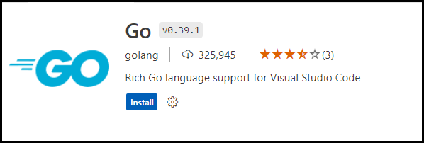

# Extension Marketplace

Increase the power of Visual Studio Code through Extensions

The features that Visual Studio Code includes out-of-the-box are just the start. VS Code extensions let you add languages, debuggers, and tools to your installation to support your development workflow. VS Code's rich extensibility model lets extension authors plug directly into the VS Code UI and contribute functionality through the same APIs used by VS Code. This article explains how to find, install, and manage VS Code extensions from the [Visual Studio Code Marketplace](https://marketplace.visualstudio.com/VSCode).

## Browse for extensions
You can browse and install extensions from within VS Code. Bring up the Extensions view by clicking on the Extensions icon in the Activity Bar on the side of VS Code or the View: Extensions command `Ctrl+Shift+X`.

Each extension in the list includes a brief description, the publisher, the download count, and a five star rating. You can select the extension item to display the extension's details page where you can learn more.

## The extensions I use for my code server configuration.

To install an extension, select the Install button. Once the installation is complete, the Install button will change to the Manage gear button.

### EditorConfig for VS Code

### Golang

### Latex Workshop

### Markdown all in one

### R Editor Support

### R Debugger Support

### Code Spell Checker

### German Code Spell Checker

### Vim

